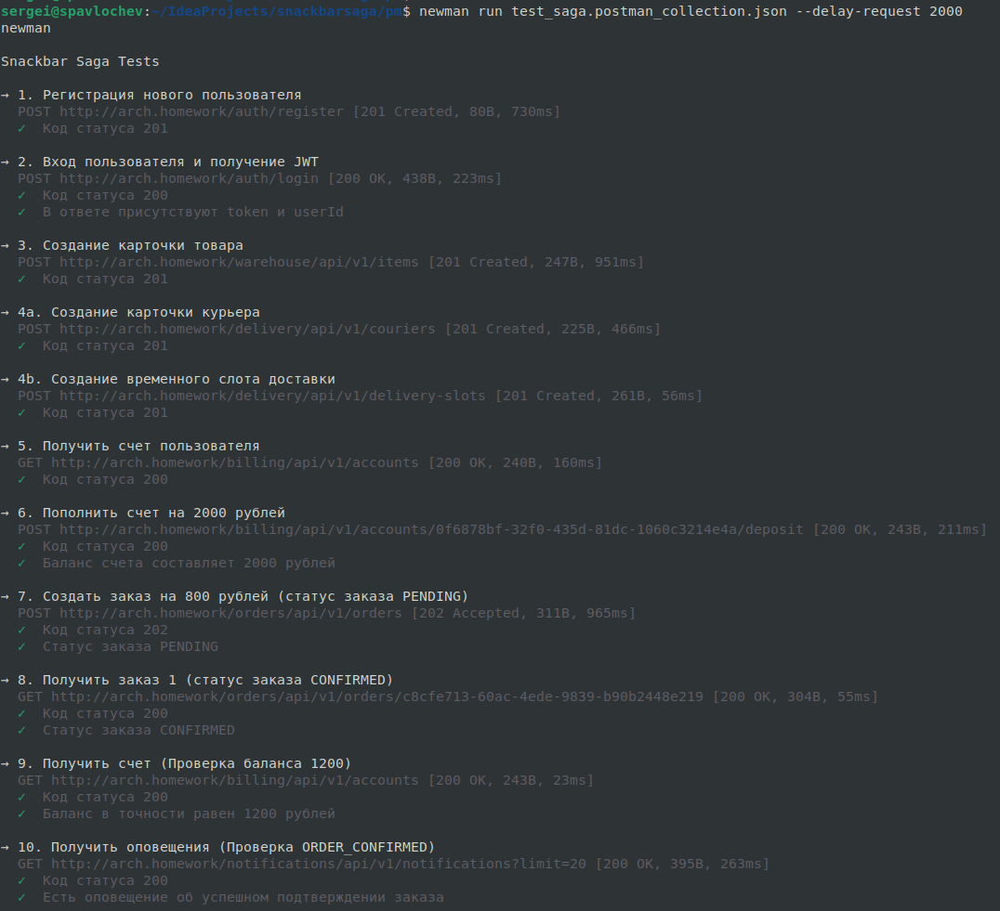
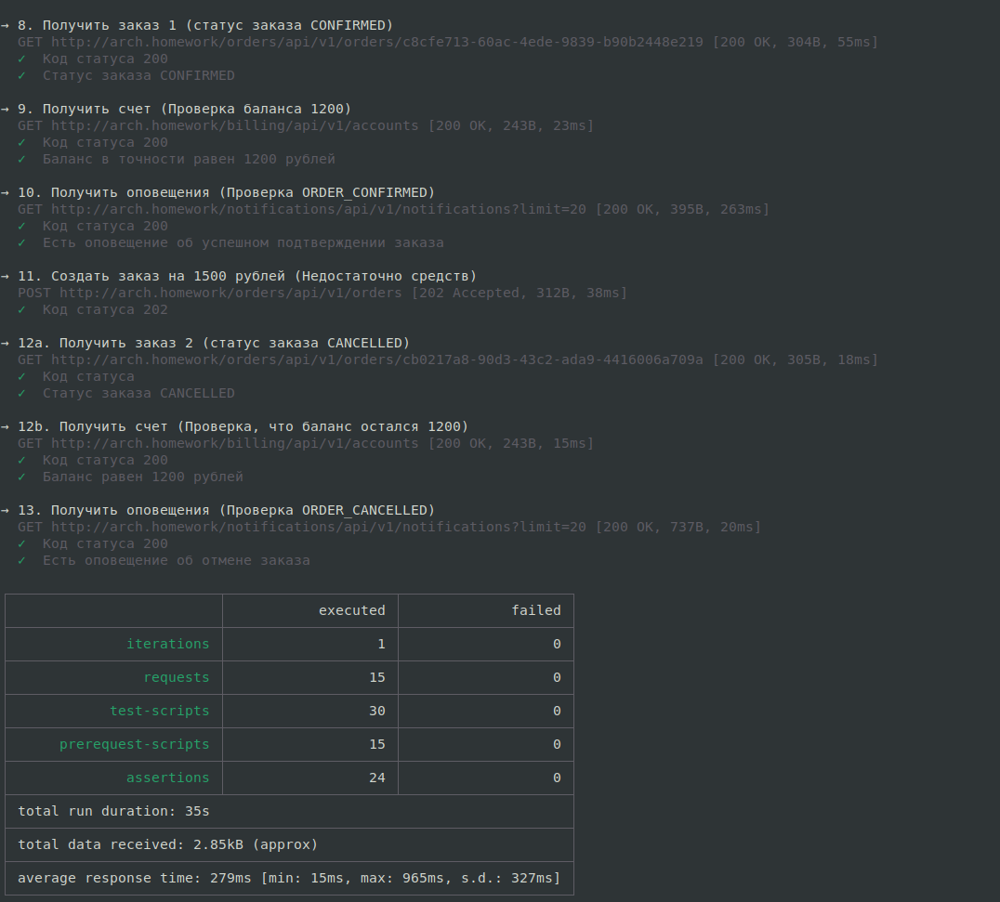

# Закусочная, Микросервисная Архитектура

## Оглавление

- [Описание](#описание)
  - [Общие сведения](#общие-сведения)
  - [Создание заказа](#создание-заказа)
- [Установка приложения](#установка-приложения)
  - [Подготовка](#подготовка)
  - [Создание неймспейсов](#создание-неймспейсов)
  - [Развёртывание PostgreSQL и инициализация баз данных](#развёртывание-postgresql-и-инициализация-баз-данных)
  - [Развёртывание Kafka](#развёртывание-kafka)
  - [Установка Traefik](#установка-traefik)
  - [Развёртывание микросервисов приложения](#развёртывание-микросервисов-приложения)
  - [Ingress](#ingress)
- [Тестирование](#тестирование)

## Описание

### Общие сведения

Приложение "Закусочная" реализовано как набор следующих микросервисов:
* `auth-service`. Сервис, отвечающий за регистрацию и аутентификацию пользователей, создает и валидирует JWT, 
публикует события пользователя.
* `order-service`. Сервис заказов, отвечает за создание заказа и публикацию событий заказа.
* `billing-service`. Сервис оплаты, отвечает за операции по счету клиента, слушает события, связанные с пользователем и  
  заказом, публикует события, связанные с действиями по счету.
* `warehouse-service`. Сервис склада, отвечает за резервирование позиций для заказа.
* `delivery-service`. Сервис доставки заказов, отвечает за резервирование курьера в определенный временной слот.
* `notification-service` Сервис уведомлений, подписан на доменные события, отвечает за отправку уведомлений клиенту.

### Создание заказа

Для подтверждения заказа используется паттерн Saga на основе Оркестрации.

При создании заказа сервис `order-service` запускает процесс резервирования суммы на счете, продуктов на складе и
курьера для доставки, в случае успеха со счета списывается сумма заказа и заказ переводится в статус CONFIRMED / Подтвержден.
Если на каком-либо шаге происходит ошибка, то производятся компенсирующие
действия для отмены резерва и переводит заказ в статус CANCELLED / Отменен с уведомлением клиента.

В случае успеха цепочка вызовов выглядит так:
1. Создание заказа в статусе PENDING.
2. Запуск саги (создание новой записи в таблице `order_saga_states`).
3. Резервируется сумма заказа на счете клиента (order-service -> billing-service).
4. Резервируется товар на складе (order-service -> warehouse-service).
5. Резервируется курьер на выбранный временной слот (order-service -> delivery-service).
6. Подтверждение покупки, со счета списывается сумма заказа (order-service -> billing-service).
7. Заказ переводится в статус CONFIRMED и создается событие о подтверждении заказа OrderConfirmed.

В случае неудачи на каком либо шаге запускается компенсация, ниже пример в случае ошибки резервирования курьера:
1. Создание заказа в статусе PENDING.
2. Запуск саги (создание новой записи в таблице `order_saga_states`).
3. Резервируется сумма заказа на счете клиента (order-service -> billing-service).
4. Резервируется товар на складе (order-service -> warehouse-service).
5. Резервируется курьер на выбранный временной слот (order-service -> delivery-service), ошибка.
6. Компенсация - снятие резерва с товара на складе (order-service -> warehouse-service).
7. Компенсация - снятие резерва со счета клиента (order-service -> billing-service).
8. Заказ переводится в статус CANCELLED и создается событие об отмене заказа OrderCancelled.

В случае если сага падает на этапе компенсирующего действия, то она помечается статусом FAILED для ручной обработки
(для простоты в рамках учебного примера).

## Установка приложения

### Подготовка

1. Должен быть установлен и запущен minikube
2. Необходимо в отдельной сессии запустить: `minikube tunnel`
3. В терминале перейти в директорию `snackbar/k8s`

### Создание неймспейсов

Для развертывания приложения используется 3 неймспейса:
1. `infra` - для Postgres и Kafka. 
2. `app` - микросервисы приложения и ингресс-роутинг.
3. `ingress` - выделенный неймспейс для Traefik.

Для создания неймспейсов выполнить команду `kubectl apply -f 00-namespaces.yaml`.

### Развёртывание PostgreSQL и инициализация баз данных

Для каждого микросервиса создается отдельная база данных на общем сервере.

`kubectl apply -f 01-infra/db-secrets.yaml` \
`helm install postgresql oci://registry-1.docker.io/bitnamicharts/postgresql --namespace infra -f 01-infra/db-values.yaml` \
`kubectl apply -f 01-infra/db-init-configmap.yaml -f 01-infra/db-init-job.yaml`

### Развёртывание Kafka

`kubectl apply -f 01-infra/kafka.yaml -f 01-infra/kafka-init-job.yaml`

### Установка Traefik

`helm repo add traefik https://traefik.github.io/charts` \
`helm repo update` \
`helm install traefik traefik/traefik --namespace ingress`

### Развёртывание микросервисов приложения

`kubectl apply -f 02-app/common-secrets.yaml \` \
`-f 02-app/auth-service.yaml \` \
`-f 02-app/billing-service.yaml \` \
`-f 02-app/order-service.yaml \` \
`-f 02-app/notification-service.yaml \` \
`-f 02-app/delivery-service.yaml \` \
`-f 02-app/warehouse-service.yaml`

### Ingress

`kubectl apply -f 02-app/traefik-routing.yaml`

## Тестирование

Коллекция тестов Postman: [коллекция тестов Postman](pm/test_saga.postman_collection.json)

Для запуска тестов перейти в директорию `snackbar/pm` и использовать утилиту `newman`. 

Команда для прогона всех тестов (добавлена задержка 2 секунды, чтобы сага успела отработать): \
`newman run test_saga.postman_collection.json --delay-request 2000`

Так как в тестах используется имя хоста `arch.homework`, то предварительно нужно в файл `/etc/hosts` добавить строку
маппинга для внешнего IP traefik.

Так как в приложении используется асинхронное взаимодействие сервисов между собой, то в тестах используется 
механизм ретраев, который позволяет проверить нужное поведение с некоторой отсрочкой.

Скриншоты локального прогона тестов:

